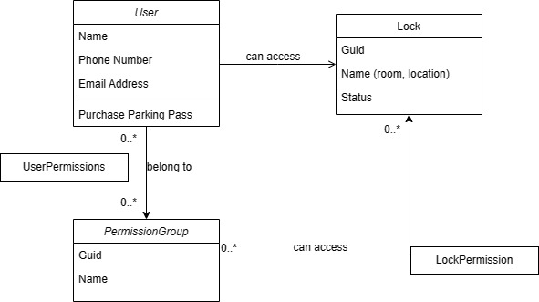

##Description
SmartAccess Backend is a RESTful API designed to control door locks in a smart office environment. This project exposes endpoints that allow authorized users to open door locks through secure authentication mechanisms. It is built on modern technologies and designed for seamless integration with smart building systems.

##The key features of SmartAccess Backend include:

###Secure Authentication:
The backend uses OpenID Connect (OIDC) to authenticate users and ensure only authorized personnel can access the endpoints.
###Locking Api Endpoints:
Exposes HTTP endpoints that allow users to send commands to open door locks.
Permission Control (RBAC): Ensures that only users with appropriate permissions group can unlock specific doors.
###Event Logging:
Logs all door unlock events for security and audit purposes.
###Integration: 
Designed to work with different clients(apps).

##Tech stack
.Net 8.
EF Core.
Duende Identity Server.
Sql Server.

##Design
The design of SmartAccess Backend focuses on a modular architecture, security, scalability, and integration with existing systems. This section outlines the key design components, architecture, and considerations for building a robust backend system to control smart door locks.

####Domain Entities:

####General Architecture:

---

##Architecture
The SmartAccess Backend follows a service-oriented architecture with the following key components:

####Identity Service:
Utilizes OpenID Connect (OIDC) for user authentication and issues JWT (JSON Web Tokens) for authorization.
####Locking Service:
Provides endpoints to open door locks based on user permissions. This service interacts with the underlying hardware or building management systems to send unlock commands.
####Event Logging:
Logs all door control activities to maintain a secure audit trail.

####Administration Service:
Provides endpoints to manage user lock access permissions.

##Data Flow
The typical data flow within SmartAccess Backend is as follows:

####Identity:
##### Clients authenticate with the Identity Service, which validates credentials and issues a JWT token upon successful authentication.
##### The Authorization Service checks the user's roles and permissions based on the JWT token, ensuring they have access to Adminstration endpoints.
##### Users can request to unlock a door through the Lock Service based on administered user permissions from administration service.
##### Each door unlock request is logged in the Event Logging system to maintain an audit trail for security purposes.

---